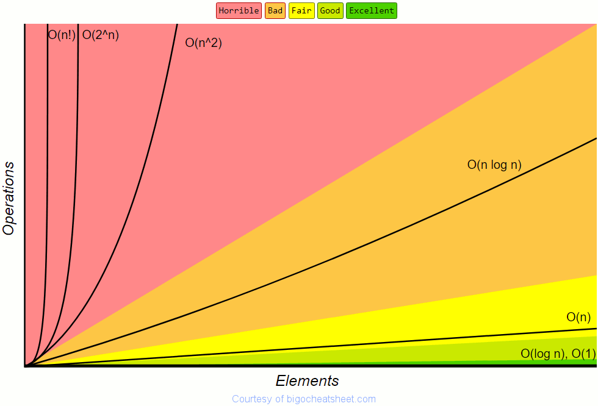

# Big O Notation
## What is Big O Notation?
Imagine you are working to build software for Tesla's new self driving cars. You create an AI for the car and it works! The only down side is that when your software is running, it takes several seconds for the AI to make the next decision. Now that is an issue. In many siutations when driving, a second of a difference can make all the difference between a close call and a wreck. As developers we want programs that execute fast. Now most programs will run very fast given very little data. It is when we are given a lot of data that the time to execute can increase dramatically. 
Ideally a great code would run the same speed or close to the same speed with any amount of data added to it. This would be O(1) notation. Many times we settle with having a program that increases the same amount you increase the data by. This is O(logn) notation. We always want to shoot for the O(1) or O(n). (These are read as O of 1 or O of n.)

## A Look at a Big Oh Notation Graph

## Calculating Big O Notation
### Some Basic Rules

