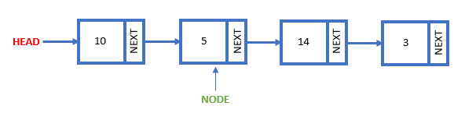
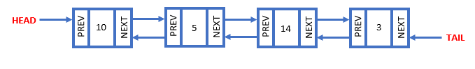
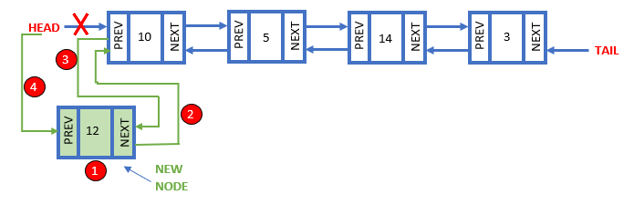
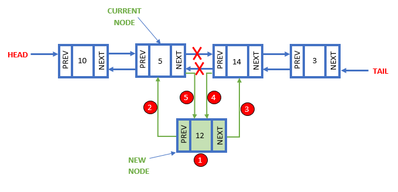
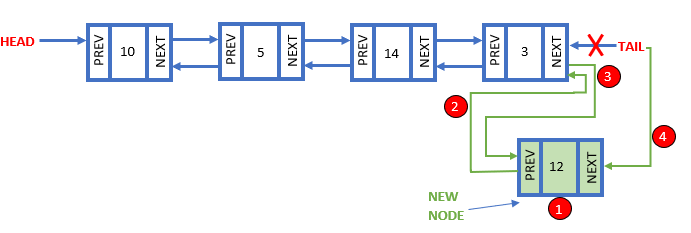
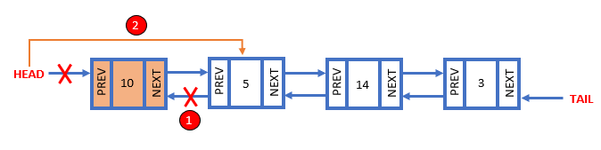
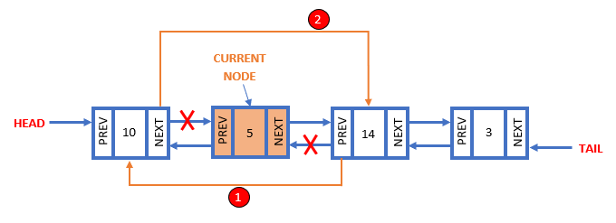
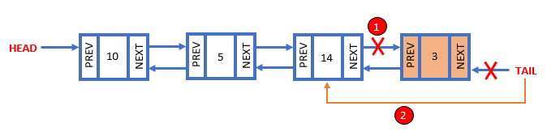

# Linked List
## What are linked lists? 
Linked List can be intimidating but don't you worry! They can actually be lots of fun! A major characteristic of linked lists is that they are linear data structures. This means that there is a sequence and an order to how they can be traversed and constructed. Each data element is connected to another data element in form of a pointer. Each data element is containted in a NODE. A node holds the data and the link to the next node. The very first node is called the HEAD and the very last is called the TAIL. Since python does not have linked list inside their library we have to create them with functions and this can cause it to be overwhelming at first. When going throuh the problems, feel fre to reference some of the images and graphs below to help you better understand and remember the process. 

## Doubly Linked Lists
These Linked List not only contain a link to the next node but the previous node as well. This allows us to go forward and backwork through the linked list. We will focus on this in our examples of inserting and deleting because if you understand how to work with doubly linked list, singular linked list are much simpler. 

## How to Implement
### Inserting 
#### Inserting From the Head
To Insert at the head we need to:
1) Create our new node (new_node)
2) Set the NEXT of the new node to the current head (new_node.next = self.head)
3) Set PREV of current head to the new node (self.head.prev = new_node)
4) Set the head equal to the new node (self.head = new_node)

#### Inserting in the Middle
To Insert in the middle of our Linked List we need to:
1) Create our new node (new_node)
2) Set PREV of the new node to the current node (new_node.prev = current)
3) Set NEXT of new node to the next node after the current (new_node.next = current.next)
4) Set PREV of next mode after current node to the new node, establishing this connection will automatically delete the previous connection (current.next.prev = new_node)
5) Set NEXT of current node to new node (current.next = new_node)

#### Inserting From the Tail
To Insert at the tail we need to:
1) Create our new node (new_node)
2) Set PREV of the new node to the current tail (new_node.prev = self.tail)
3) Set NEXT of current tail to the new node (self.tail.next = new_node)
4) Set the tail equal to the new node (self.tail = new_node)

### Deleting 
Deleting from a Linked List is a lot easier then inserting. Mainly because we do not create a new node. All we have to do is reset the connections around the node we are deleting then the node will be deleted because it is no longer connected to our linked list. 

#### Deleting From the Head
To delete from the head we need to:
1) Set PREV of the second node to none (self.head.next.prev = None) We used self.head.next to reference the second node and then PREV to set that connection. 
2) Set HEAD to the second node (self.head = self.head.next) Each time we set a connection, it deleted one of the connections to the node we wanted to delete. 

#### Deleting in the Middle
Remember that we are wanting to make these connections go arround the node we are trying to delete so that our node no longer has any connections to our linked list. 
To delete from the middle we need to:
1) Set PREV of the node that follows the node we are trying to delete (current node) to before the node we are trying to delete. (current.next.prev = current.prev)
2) Set the next link of the node before our current node to the node that follows our current node. (current.prev.next - current.next)

#### Deleting From the Tail
To delete from the tail we need to:
1) Set NEXT of the second  to last node to none (self.tail.prev.next = None)
2) Set TAIL to the second to last node (self.tail = self.tail.prev)

| Common Linked List Terms and Operations  | What does it do? | How to write it in Python | Big O Timing |
| ------------- | ------------- | ------------- | ------------- |
| insert_head(value)  | Adds data before the head  | my_deque.appendleft(value) | O(1)|
| insert_tail(value)  | Adds data after the tail  | my_deque.append(value) | O(1) |
| insert(i, value)  | Adds data after node "i"  | my_deque.insert(i, value) | O(n), the reason this is O(n) is because it has to loop through the linked list|
| remove_head()  | Removes the head | value = my_deque.popleft() | O(1)|
| remove_tail(index)  | Removes the tail | value = my_deque.pop() | O(1)|
| remove(i)  | Removes node "i" | del my_deque[i] | O(n), again the reason this is O(n) is because it has to loop through the linked list |
| size()  | Return size of the linked list  | length = len(my_deque) | O(1)|
| empty()  | Returns true if the length of the linde list is zero. | if len(my_deque) == 0: | O(1)|

## Performance of Linked Lists

### Problem 1
### Solution 1
## Try it on your own!
Creating your own linked list https://realpython.com/linked-lists-python/#implementing-your-own-linked-list
