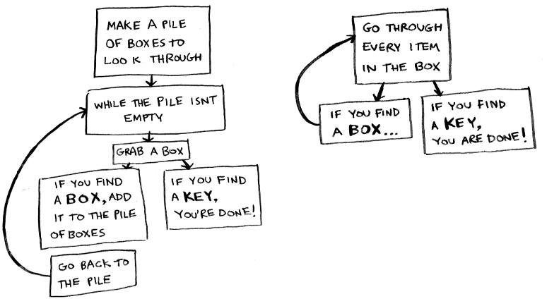

# Quick Look at Recursion!

## What is Recursion?
In life we are used to calling other peoples' names out loud. But it is kind of weird to call out your own name out loud! Some people would even look at you a little funny and keep their distance if they saw you doing so. Well recursion is just that, it is a function that calls itself again and again. It remeinds me a lot of the movie Inception! In the movie they are in a dream, inside a dream, inside a dream. Each of those dreams are going on at the same time. Same thing happens to the functions. Each time a function is called the function that calls the new function waits until that function is done runnning to finish their code. Just like in the movie, when they leave or finihs one dream they are pulled back into the previous dream. 

When would we use this? If we wanted to solve large factorials or traverse/go through all the data in a tree, we would use recursion to process these. To better process recursion visually look at the image below created by Free Code Camp. The issue is we have a ton of boxes and in one of the boxes is a key to help us escape. The left side is how to solve the issue with if statements and more of a iterative approach. The right side is how we could approach the issue if we use recursion!

## The Rules of Recursion
The two rules of recursion are:

1) Always have a base case. A base case is a situation that would not need us to call the function again. It is sort of like a break statement for a loop. It is usually what we are looking for in our recursion. 
2) Calling the function on a smaller problem. If we are calling the function on a larger problem, we are not getting anywhere. No progress is being made and the code would run forever. 

### Quick Links
* [Big O Crash Course](BIGO.md)
* [Quick Look at Recursion](RECURSION.md)
* [Queue](QUEUE.md)
* [Linked List](LINKEDLIST.md)
* [Trees](TREES.md)

Go back to our main page? [Click Here](README.md)
