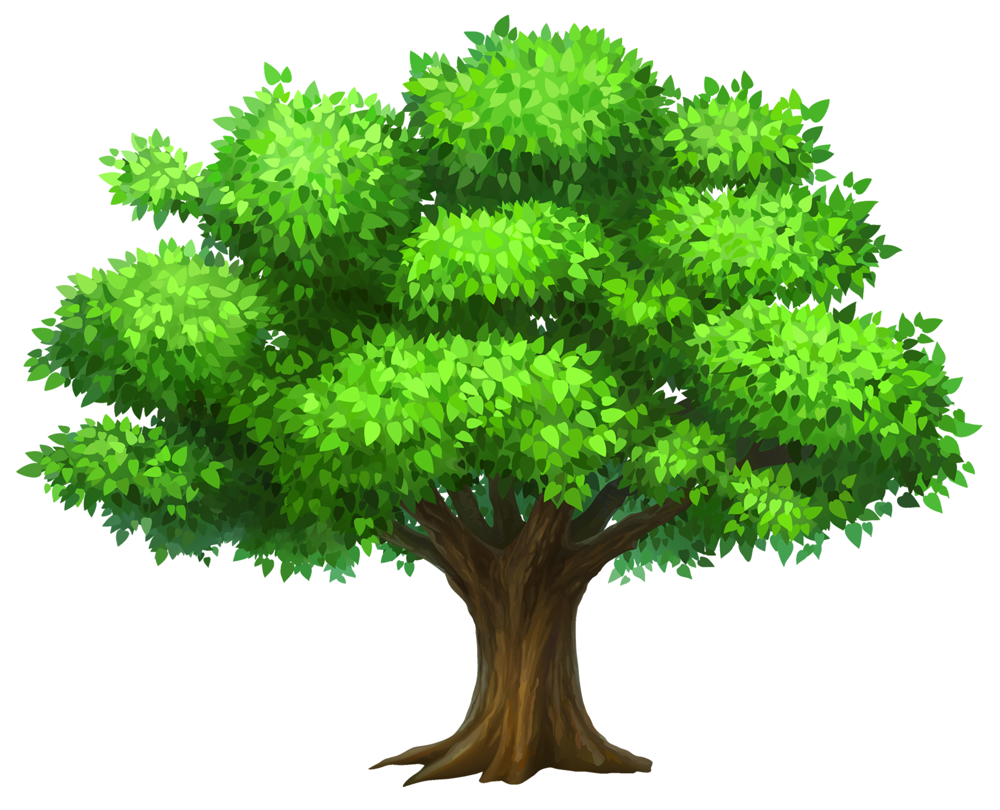
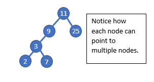
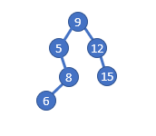
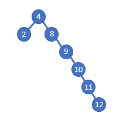

# Trees
## What are Trees?
Yes, we all know or should know the trees that grow in nature and provide us with beautiful sceneary and decorate our lawns with wonderful autumn colors but those are not the trees we are talking about today. We are discussing the data structure trees! Trees are similar to our last data structure we studied, Linked List. Imagine a linked list but each node could connect to more than one node down the line. So instead of a NEXT they have multiple nodes they point to. This can also be said that each parent node has multiple children nodes. 

   

## Binary
A binary tree is a tree that each element or parent node has at most two children nodes. Since there are at most two children nodes, we use the term left and right. So you can think of it like a linked list but instead of NEXT we have LEFT and RIGHT. The example of a tree above is actually a binary tree since each node has at most only 2 nodes it leads to. Notice how the values are organized, the example is actually a binary search tree!

## Binary Search Trees
Binary search trees are great! The reason we like a binary search tree is because searching through a binary search tree is really fast because the data is organized as it is entered into the tree. Elements are compred to a node and if they are greater in value they will move to the right child spot of the node. If there is another element in that spot already then the new element is compare to that one to see if it will move down to the child left or right spot. This continues until a spot is found that is empty. This means the children to the left of an element will always be less and the right will always be greater. This allows our search time to be cut in half because we instantly cut half of our tree out of the equation. 

## Tree Height? 
Every node level will add to the height. So if there is only one node in the tree then the height would be one. Now if that node had a child node and that child node had its own child node the height of that last child node would be three. That may be a little confusing so lets look at the tree below and use it as a reference. The 15 would be at a height of three along with the mode 8. The nodes 5 and 12 would both be at a height of two. Finally the 6 would be a height of four, giving the tree a height of four! 

## Balanced VS Unbalanced
Like Thanos said in Avengers, perfectly balanced, as all things should be. We like balanced trees because they are easy on the eyes and we aren't wasting space. A balanced tree is one that has the same or close to the same amount of elements or data on one side of the tree as the other side of the tree. Below you have two examples, one of a balance tree and the other of an unbalanced tree.

### Unbalanced

### Balanced

## Implementing Trees

### Inserting into a Binary Search Tree
To insert into the tree we are going to use recursion because we need to find an open space to place our new data. An empty spot to add the new node will be our base case! The problem we will be recursion is comparing our new data to the current node then seeing if it would go left or right based on if it is lesser or greater. Then we would go to that next node and see if it was empty. If it wasn't we would do it again until we reached our based case. 
You would have two insert functions, usually one is insert and the other _ insert. The insert function would be called when the program ran to insert data into the tree. Then the insert function would call the _ insert function, which would recurse throught the tree like we talked about earlier.

A few things to remember: 
1) Establish a base case in the _insert function so the code knows when to stop the recursion. 
2) Each node will have a left and a right. Left means the value is less than the current node and right is greater. 
3) To start searching at the root or first node. If there is none then create the first node. 

Now try looking at problem #1 to see if you can create the insert functions!

### Traversing through a Binary Search Tree

### Common Terms and Operations
| Common Tree Terms and Operations  | What does it do? | Big O Timing |
| ------------- | ------------- | ------------- |
| insert(value) | Adds data into the tree | O(log n) |
| remove(value)  | Remove data from the tree. | O(log n) |
| contains(value)  | Determine if data is in the tree.  | O(log n)|
| traverse_forward  | Visit all objects from smallest to largest. | O(n) |
| traverse_reverse  | Visit all objects from largest to smallest. | O(n)|
| height(node)  | Determine the height of a node. If the height of the tree is needed, the root node is provided. | O(n)|
| size()  | Return size of the Binary search tree | O(1) The size is actually kept within the tree class|
| empty()  | Returns true if the root node is empty. This can also be done by checking the size for 0. | O(1) We just have to check the first node or root to know if it is empty|

### Problem 1
https://qvault.io/python/binary-search-tree-in-python/
### Problem 2

## Why use Trees?
